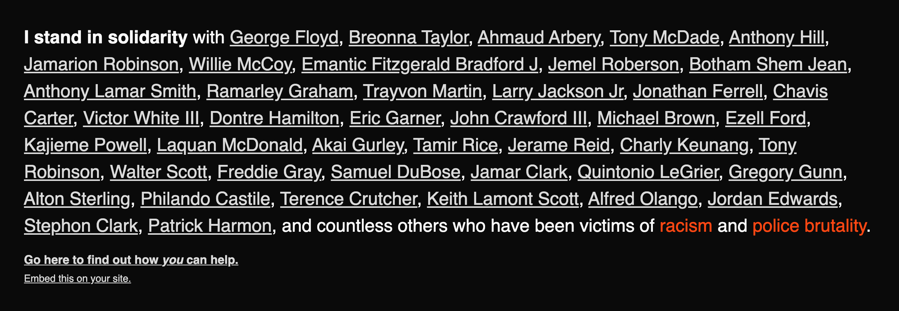

```html
<!-- Somewhere in your page -->
<script src="https://unpkg.com/i-stand/black-lives.js" type="module"></script>

<!-- After the opening <body> tag -->
<black-lives></black-lives>
```

This will add a banner to your site that looks like this:


